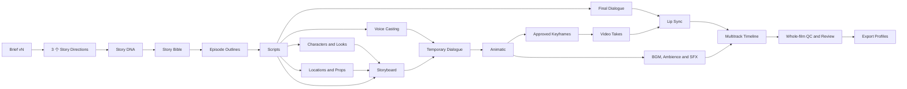

# AI 短剧工作台优化执行方案

- 状态：Implemented（本地单用户 Workflow v2；真实音频供应商与视频媒体暂存仍按 ADR-0002 延后）
- 版本：v1.0
- 日期：2026-07-14
- 适用基线：React/Vite SPA + FastAPI + SQLAlchemy/Alembic + SQLite WAL + 本地资产目录 + 持久化 Worker
- 目标：在不推翻现有可运行 MVP 的前提下，把已确认的 13 步创作流程演进为可版本化、可审核、可恢复、可并行的多模态短剧生产系统

## 1. 执行结论

### 1.1 2026-07-14 执行状态

Phase 0–8 已落地：Handler Registry、Brief v2、3 个故事方向、Story Bible/Outline/Script、多角色与视觉圣经、Workflow DAG、动态 Storyboard/Animatic、正式图片/视频生成与 QC、音频 Cue/Lip Sync 降级、六轨 Timeline、8 项整片 QC、G1–G5 以及 Profile × Language Delivery Matrix 均已进入同一持久化业务闭环。

当前实现严格保留两个阶段性边界：音频类能力使用 Adapter-first 确定性 Mock；视频源图媒体暂存未启用时显式阻断或降级。详细验收证据见 `docs/TEST_EVIDENCE.md`，运行与迁移方式见 `docs/RUNBOOK.md`。

本轮优化不重写现有系统，也不立即拆微服务。保留并强化以下已经验证有效的能力：

- Project、Brief、Job、Asset、Take、Timeline、Change Set 与 Export 的持久化事实源；
- 幂等键、乐观锁、任务租约、心跳、重试、取消和进程恢复；
- SSE 事件流与轮询后备；
- 不可变 Timeline、比较、批准、回滚和影响分析；
- 服务端 Provider 调用、结果下载、资产入库和生成证据；
- 角色参考绑定、Look Version、身份一致性检查和人工审核门禁；
- 无外部 Key 时仍能完成全流程的确定性 Mock。

目标架构采用两层表达：

1. **用户层只展示 5 个核心确认门禁**：Brief、故事与剧本、角色与视觉世界、Storyboard/Animatic、整片 Preview。
2. **系统层保留 13 个生产节点**：把中间步骤编排为依赖图，满足条件的任务自动并行，只有创作决策和高风险结果需要用户确认。

首要优化不是继续在现有 Worker 的 `if/elif` 中增加更多模型调用，而是先建立：

- 正式的 Story DNA、Story Bible、Episode Outline、Script 等版本实体；
- 可表达依赖、并行、门禁和降级的 Workflow DAG；
- 图片、视频、文本、语音、音乐、音效和 QC 的统一 Provider 适配层；
- 可容纳视频、对白、BGM、环境音、音效和字幕的多轨 Timeline；
- 从 Brief 到 Export 的完整生成血缘和权利记录。

## 2. 产品范围

### 2.1 本方案覆盖

- Rough idea、参考素材、目标用户、区域市场、语言和平台要求的结构化 Brief；
- 3 个差异化故事方向、选择/合并、Story DNA、Story Bible 和分集大纲；
- 逐集结构化剧本、场景、动作、对白、旁白和声音意图；
- 多角色、角色候选、Look Version、Voice Version、地点和道具参考；
- 动态镜头拆解、低成本 Storyboard、临时音频 Animatic；
- 正式关键帧、视频、配音、口型同步、BGM、环境音和音效；
- 多轨剪辑、混音、字幕、整片 QC、局部修改和多平台导出；
- Mock 与真实 Provider 共用同一业务合同；
- 单用户本地工作台的完整恢复、审计和测试闭环。

### 2.2 前三个 Release 明确不做

- 多租户、团队协作、细粒度 RBAC、评论指派和在线协同编辑；
- 支付、真实计费、订阅、商业发票和复杂额度系统；
- 自动发布到外部平台；
- 通用专业 NLE 替代品；
- 任意数量 Provider 的动态插件市场；
- 公网高并发和大规模分布式渲染；
- 未取得明确授权的真人声音克隆；
- 把“吸引力评分”包装成确定性预测。

现有 `ADR-0001` 把多集、云对象存储和全片真实视频列为非目标。进入真实视频自动化与多集生产前，必须新增 `ADR-0002`，明确哪些约束被扩展，不能通过零散代码变更静默突破原决策。

## 3. 当前架构盘点与目标差距

| 领域 | 当前实现 | 主要差距 | 优化方向 |
|---|---|---|---|
| 创建入口 | 一句话、单文件参考素材、本地草稿 | 目标用户/区域/语言缺失；平台单选；浏览器演示 Proposal 与服务端 Proposal 重复 | Brief v2；主目标/次目标；创建后服务端为唯一事实源 |
| 导演方案 | 固定 Mock 三幕八镜，单一 Proposal | 没有 3 方向、合并、真实文本 Provider、Story DNA | Proposal Batch + Story DNA Version |
| 故事与剧本 | `StoryVersion.payload_json` 承载批准 Proposal | 无 Story Bible、分集大纲、Script Version、结构化台词 | 增加正式创作版本实体和首集校准流程 |
| 角色 | 固定一个主角、两个确定性 PNG 候选 | 无多角色、结构化视觉圣经、正式 Look 实体、真实候选生成 | 多角色 + Character Look Version + 引用资产 |
| 场景/道具 | Shot 中只有地点字符串和时间 | 无 Location/Prop ID、参考版本和镜头绑定 | Production Design 实体与引用图 |
| 分镜 | 固定 3 场 8 镜；描述为 Mock；对白为空 | 不从 Script 动态拆镜；无低成本 Animatic 和镜头生成规格 | Storyboard Version + Shot Spec + 临时音轨 |
| 图片 | Seedream REST、参考图、Seed、Take、身份 QC 已打通 | 仅单镜头手动触发；缺批量路由、通用 QC 和成本策略 | 在 Workflow DAG 中批量 fan-out，沿用现有安全链路 |
| 视频 | Seedance 单镜头异步任务已打通 | 需要用户提供公网图片 URL；缺自动源图暂存、批量生成和视频 QC | Provider 可访问媒体暂存 ADR + 视频节点 + 降级策略 |
| 声音 | 无正式 TTS、Voice、BGM、SFX；Preview 使用静音 AAC | 无声音实体、Provider、版本、时间码和权利证据 | Audio Cue/Take + Voice/Music/SFX Provider |
| Timeline | `TimelineItem` 只引用每镜头一个 Take；输出固定 MP4/SRT/VTT/Manifest | 无多轨、Clip 入出点、音量、音频分轨和本地化 | Timeline Track/Clip + Render Artifact |
| Revision | 支持 Shot/Scene/Project 影响分析和不可变 Timeline | AUDIO Revision 仅替换临时字幕文本；依赖传播粒度不足 | 基于实体依赖图计算失效范围，只重跑受影响节点 |
| 审核 | 角色身份、候选 Take、Preview 批准 | 审核模型与 UI 仍是镜头特化 | 通用 Quality Check + Review Record + Gate |
| Worker | 单进程、单队列、长 `if/elif` 分发 | 无依赖图、fan-out/fan-in、限流和节点门禁 | Handler Registry + Workflow Run/Node + Job Dependency |
| Provider | 图片、视频、Prompt Enhance、视觉身份 QC | 缺统一合同、健康度、路由、使用量和降级信息 | Provider Registry + Routing Policy + Generation Record |
| 导出 | 单一 `hybrid_720p` | 无多平台/多语言 Profile、音频分轨和完整来源清单 | Export Profile + Rights Preflight + Provenance Manifest |

### 3.1 必须优先偿还的事实源问题

当前 `NewProjectPage` 会先在浏览器生成一份演示 Proposal，项目创建后又由服务端生成持久化 Proposal；`StudioContext` 同时维护浏览器演示状态与 API 状态。优化后遵循：

- 创建前允许把未提交文本临时保存在浏览器；
- 一旦创建 Project，所有可恢复的业务状态只来自 FastAPI/SQLite；
- Mock 继续保留，但必须在服务端通过同一 Job、Asset 和 Version 合同执行；
- 前端只能做明确标识的 optimistic UI，不能伪造成功任务或正式版本；
- 轮询/SSE 刷新不得覆盖用户尚未提交的本地编辑。

## 4. 目标用户流程：5 个门禁、13 个生产节点

### 4.1 用户可见的 5 个核心门禁

| Gate | 用户确认内容 | 批准后锁定的版本 |
|---|---|---|
| G1 Brief | 主/次目标用户、市场、平台、语言、题材、时长、约束、参考素材与 AI 假设 | `Brief Version` |
| G2 Story & Script | 故事方向、Story DNA、角色文字设定、分集大纲、首集及后续剧本 | `Story DNA`、`Story Bible`、`Episode Outline`、`Script Version` |
| G3 Pre-production | 角色形象、Look、Voice、地点、道具和视觉风格 | `Character/Look/Voice/Location/Prop Version` |
| G4 Storyboard & Animatic | 镜头拆解、构图、时长、临时对白、临时音乐和粗剪节奏 | `Storyboard Version`、`Timeline Draft` |
| G5 Picture Lock | 正式视频、配音、音乐、字幕、混音、整片质量和权利状态 | `Approved Timeline Version` |

导出是批准后的执行命令和权利预检，不再额外制造一个创作门禁。

### 4.2 系统生产依赖图



规则：

- G2 批准后，Character、Voice 和 Location/Prop 三条支线可以并行；
- G4 前使用临时 TTS/BGM 验证节奏，正式声音可以在 G4 后继续并行；
- 正式视频只消费已批准关键帧；有角色镜头必须经过身份一致性门禁；
- 任一非关键媒体节点失败时，Workflow 可以选择已声明的降级路径，不允许静默跳过；
- 降级结果必须在 Preview、Manifest 和导出预检中明确显示。

## 5. 目标领域模型

### 5.1 Brief v2

保留 `Project` 上用于列表和筛选的主字段，`BriefVersion` 继续作为事实源。新增：

- `primary_audience_json`：唯一主目标画像；
- `secondary_audiences_json`：可多选的次目标画像；
- `primary_market` 与 `secondary_markets_json`；
- `canonical_language` 与 `localization_targets_json`；
- `platform_targets_json`：每个平台包含 priority、aspect ratio、duration、caption policy；
- `content_requirements_json` 与 `content_avoidances_json`；
- `creative_defaults_json`：系统采用的非阻断默认值；
- `blocking_questions_json`：未回答前不得进入 Proposal 的冲突问题；
- `payload_schema_version`。

约束：目标用户、市场和平台虽可多选，但必须各有一个主目标；发生冲突时以主目标为生成基准，次目标通过本地化或 Export Profile 处理，不能让模型自行猜测优先级。

### 5.2 Story 与 Script 版本

沿用 `ProposalVersion` 和 `StoryVersion`，逐步增加：

- `ProposalBatch`：同一次请求产生的 3 个方向、共同 Brief、配置版本和生成证据；
- `ProposalVersion.direction_key`、`source_proposal_ids_json`：支持选择、合并和重写；
- `StoryVersion` 明确承担 Story DNA 角色，增加 schema version 与来源 Proposal；
- `StoryBibleVersion`：世界观、规则、角色文字设定、关系、伏笔和连续性约束；
- `EpisodeOutlineVersion`：每集 Hook、目标、冲突、反转、悬念和时长预算；
- `ScriptVersion`：按 Episode 版本化；
- `ScriptScene`：场景标题、地点、时间、目的、情绪、时长；
- `ScriptLine`：角色、文本、旁白类型、情绪、语速、停顿、顺序和预计时长。

所有版本实体统一字段：`version`、`status`、`payload_json`、`content_hash`、`parent_version_id`、`provider`、`model`、`config_version`、`approved_at/by`、`created_at`。

### 5.3 Pre-production 实体

- `Character`：支持多个主角、配角和群众角色，并回链 Story Bible Character Key；
- `CharacterLookVersion`：服装、发型、妆容、配饰、使用范围和锁定参考资产；
- `CharacterCandidate`：保留现表，扩展 Prompt、Provider、Model 和 Generation Record；
- `VoiceProfileVersion`：Voice ID、语言、口音、音色、语速、许可与试听资产；
- `Location` / `LocationVersion`：空间设定、地区、布局、灯光和主参考图；
- `Prop` / `PropVersion`：关键道具设定、连续性规则和参考图；
- `VisualBibleVersion`：全局色彩、材质、镜头语言和禁用元素；
- `EntityAssetBinding`：为版本实体绑定一至多份参考资产，避免把引用关系继续塞入零散 JSON。

现有 `shots.character_ids_json` 与 `character_look_version` 在兼容期保留，但新增规范化的 `ShotCharacterBinding`：`shot_id`、`character_id`、`look_version_id`、`reference_asset_ids`、`binding_role`。完成数据回填后，新代码只写规范化关系。

### 5.4 Storyboard 与媒体实体

- `StoryboardVersion`：回链 Script Version 和 Pre-production 版本集合；
- `Shot` 继续表示稳定的逻辑镜头；新增 `script_scene_id`、`storyboard_version_id`；
- `ShotSpecVersion`：景别、构图、机位、动作、时长、首尾帧、绑定实体、提示词和负向约束；
- `GenerationRecord`：Job、Provider、Model、请求参数、Seed、引用资产、Provider Task ID、用量、成本估算和响应摘要；
- `QualityCheck`：检查类型、规则/模型版本、分数、问题列表和证据；
- `ReviewRecord`：通用审核决定、问题、备注、Actor、Override 原因和审核时间；
- `Take`：增加 `media_kind` 与 `generation_record_id`，当前版本唯一约束改为“每个 Shot、每种 media kind 最多一个 current”。

候选结果的统一状态链：

`GENERATED → QC_REQUIRED → QC_PASSED/REVIEW_REQUIRED → APPROVED/REJECTED → APPLIED`

任何 Provider 成功返回都不等于业务批准。只有 `APPROVED` 的 Take 可以成为正式 Timeline Clip；人工覆盖必须留下 `ReviewRecord`。

### 5.5 Audio 与多轨 Timeline

新增：

- `AudioCue`：对白、旁白、BGM、AMBIENCE、SFX 的语义和时间需求；
- `AudioTake`：对应 Cue 的候选音频、Voice/Music Version、时长和 QC；
- `PronunciationLexiconVersion`：角色名、地名、品牌和专有词读音；
- `TimelineTrack`：VIDEO、DIALOGUE、BGM、AMBIENCE、SFX、SUBTITLE；
- `TimelineClip`：Track、Asset/Take、source entity、timeline in/out、asset in/out、gain、transition 和 metadata；
- `TimelineArtifact`：Preview MP4、字幕、Manifest、音频分轨和 QC 报告。

现有 `TimelineItem` 作为视频主轨兼容结构保留一个迁移周期；新 Timeline 同时写 Track/Clip。验证稳定后，旧读取接口改由 Track/Clip 聚合。

### 5.6 Workflow、门禁与依赖

新增：

- `WorkflowRun`：Project/Episode、Workflow Definition Version、状态和根版本；
- `WorkflowNode`：节点类型、实体、状态、输入/输出版本和降级信息；
- `JobDependency`：Job 之间的成功依赖；
- `ReviewGate`：Gate 类型、目标版本、状态、批准人和时间；
- `Job.workflow_run_id`、`workflow_node_id`、`provider_key`、`cost_estimate_json`。

Workflow Node 状态：

`BLOCKED → READY → QUEUED → RUNNING → WAITING_REVIEW → SUCCEEDED`

异常分支：`RETRY_WAIT`、`FAILED`、`CANCELLED`、`SKIPPED`、`FALLBACK_SUCCEEDED`。

Project 的 `status` 只保留粗粒度生命周期，不再为每个新模型节点增加状态值。细粒度进度来自 Workflow Run/Node 和 Review Gate。

## 6. 后端演进方案

### 6.1 Job Handler Registry

把 `PersistentJobWorker._execute()` 中不断增长的分支拆为 Handler：

```text
app/jobs/handlers/
  proposal.py
  story_bible.py
  script.py
  character.py
  storyboard.py
  image.py
  video.py
  speech.py
  music.py
  audio.py
  timeline.py
  export.py
```

每个 Handler 实现统一合同：

- 输入 schema 校验；
- 幂等业务键；
- 可恢复 checkpoint；
- 进度与事件；
- Provider Task ID 持久化；
- 输出版本/资产登记；
- 失败分类与 retryable；
- 取消传播；
- 降级结果声明。

Worker 仍可在单进程运行，但增加可配置的 `WORKER_CONCURRENCY` 和 Provider 级 semaphore。SQLite 阶段建议默认并发 2，所有外部等待在事务外完成；严禁持有数据库写事务等待 Provider。达到持续并发写入瓶颈后再立 ADR 迁移 PostgreSQL。

### 6.2 Workflow Orchestrator

Orchestrator 只负责状态推进，不直接调用 Provider：

- 根据已批准版本创建 Workflow Run；
- 为可运行节点创建幂等 Job；
- 支持镜头级 fan-out 和全片级 fan-in；
- 只有依赖节点成功或明确降级成功，后继节点才可进入 READY；
- 到达用户 Gate 时停止后继任务；
- Gate 批准后继续；拒绝或修改时生成新版本并使受影响后继节点失效；
- 失效计算复用并扩展现有 Revision Impact，不删除旧输出。

### 6.3 Provider Adapter 与路由

定义独立协议：

- `TextProvider`：Proposal、Story Bible、Outline、Script、Shot Spec；
- `ImageProvider`：角色、地点、道具、Storyboard、正式 Keyframe；
- `VideoProvider`：图生视频、首尾帧视频、取消和恢复查询；
- `SpeechProvider`：试听、TTS、时长控制；
- `LipSyncProvider`；
- `MusicProvider`；
- `SfxProvider`；
- `QcProvider`：身份、连续性、技术质量与安全检查。

路由输入包含 capability、目标质量、参考图数量、画幅、时长、语言、预算、预计延迟、Provider 健康度和用户手动覆盖。路由结果与理由写入 `GenerationRecord`。

默认实现策略：

- 文本优先复用现有 Ark Responses API；无 Key 使用确定性结构化 Mock；
- 图片继续复用现有 Seedream Adapter；
- 视频继续复用现有 Seedance Adapter；
- TTS、Lip Sync、Music 和 SFX 在 Provider 选型前先实现合同测试与确定性 Mock，不把未确认供应商硬编码进业务层；
- Provider Secret 只存在服务端环境变量，不进入 Job 输出、Asset Metadata、Manifest 或前端。

### 6.4 真实视频的媒体可达性阻断

当前 Seedance 需要公网可访问的 HTTPS 源图，而资产存储是本地目录。自动化正式视频前必须在 `ADR-0002` 中选择一种方式：

1. Provider 官方上传/素材 API；优先选择；
2. 带有效期和最小权限的临时签名媒体暂存；
3. 用户自行提供 URL 仅保留为高级调试能力，不作为主流程。

在该决策落地前，视频节点保持显式 `BLOCKED_BY_MEDIA_STAGING` 或使用静态关键帧降级，不能假装完成全自动视频生产。

### 6.5 生成血缘、成本和权利

每个正式 Asset 必须能回链：

`Brief → Story → Script → Storyboard → Shot Spec → Job → Provider Request → QC → Review → Take → Timeline → Export`

同时记录：

- Provider/Model/Config Version；
- Prompt Hash、Seed、引用资产 ID；
- Provider Task/Request ID；
- 延迟、重试次数、输入输出用量和成本估算；
- 权利状态、授权来源和临时/正式标记；
- 人工 Override。

继续使用现有 `UsageLedger` 表达演示积分，但新增 Provider Usage Measurement；两者不要混为真实账单。

## 7. API 演进

保持 `/api/v1`，新增资源式接口并为旧接口提供兼容期。

### 7.1 Brief 与 Story

```text
POST   /projects/{id}/brief-versions
GET    /projects/{id}/brief-versions
POST   /projects/{id}/story-directions
GET    /projects/{id}/story-directions
POST   /projects/{id}/story-directions/merge
POST   /projects/{id}/story-dna/{version}/approve
POST   /projects/{id}/story-bibles
POST   /projects/{id}/episode-outlines
POST   /episodes/{episode_id}/scripts
PATCH  /scripts/{script_id}/scenes/{scene_id}
POST   /scripts/{script_id}/approve
```

### 7.2 Pre-production 与 Storyboard

```text
POST   /projects/{id}/characters/generate
POST   /characters/{id}/looks/generate
POST   /characters/{id}/looks/{version}/approve
POST   /characters/{id}/voices/generate
POST   /projects/{id}/locations/generate
POST   /projects/{id}/props/generate
POST   /episodes/{id}/storyboards
PATCH  /storyboards/{id}/shots/{shot_id}
POST   /storyboards/{id}/animatics
POST   /storyboards/{id}/approve
```

### 7.3 Workflow、媒体、审核与 Timeline

```text
GET    /projects/{id}/workflow-runs
GET    /workflow-runs/{id}
POST   /workflow-runs/{id}/resume
POST   /workflow-nodes/{id}/retry
POST   /shots/{id}/image-takes
POST   /shots/{id}/video-takes
POST   /audio-cues/{id}/takes
GET    /projects/{id}/reviews
POST   /reviews/{id}/decide
GET    /timelines/{id}/tracks
POST   /timelines/{id}/render
POST   /projects/{id}/exports/estimate
POST   /projects/{id}/exports
```

所有创建型命令继续要求 `Idempotency-Key`；所有修改已批准上游版本的命令先返回影响分析，未经确认不执行。

## 8. 前端信息架构

### 8.1 建议路由

```text
/projects/:projectId/brief
/projects/:projectId/story
/projects/:projectId/preproduction
/projects/:projectId/episodes/:episodeId/storyboard
/projects/:projectId/production
/projects/:projectId/episodes/:episodeId/preview
/projects/:projectId/reviews
/projects/:projectId/tasks
```

### 8.2 Basic 与 Advanced 模式

Basic 模式只展示 5 个门禁、当前决策、阻断项和“继续生产”。系统自动选择 Provider 和并行节点。

Advanced 模式展开：

- 具体版本和依赖关系；
- Provider、Model、分辨率、候选数和预算；
- Prompt、Seed 和参考资产；
- QC 结果和生成证据；
- 单节点重试、取消和降级。

两种模式共用后端事实源，不维护两套业务状态。

### 8.3 审核中心

把现有只面向 Shot Candidate 的审核页升级为通用队列，支持：

- Story Direction、Script、Character Look、Location、Storyboard、Image/Video Take、Voice、Audio 和 Timeline；
- 按 Project、Episode、Gate、风险和状态筛选；
- 批量批准低风险结果；
- 高风险结果强制逐项确认；
- 对比上一个批准版本；
- 审核意见直接生成结构化 Revision Intent。

## 9. 分阶段实施与 PR 拆分

每个 PR 必须可独立迁移、可回滚、可在无 Provider Key 下验证，并保持旧 MVP 主路径可用。

### Phase 0：基线与合同收敛

**目标**：先消除事实源分裂和文档/迁移漂移，为后续改造建立稳定合同。

#### PR-00 Worker Handler Registry

- 在不改变现有行为的前提下定义 Job Handler 合同和注册表；
- 先迁移 Proposal、Character、Storyboard、Preview、Revision、Export、Image 和 Video Handler；
- 保留现有 claim、lease、heartbeat、retry、cancel 和恢复语义；
- 用回归测试证明拆分前后 Job 输入、输出、事件和实体状态一致；
- 后续新 Job 类型只能通过 Handler Registry 注册，不再扩展 Worker 的中心 `if/elif`。

验收：现有完整 Smoke 的 Job 顺序、事件、失败恢复和输出 Hash 不变。

#### PR-01 基线校准

- 更新测试证据到当前 Alembic Head 和测试数量；
- 为 Project/Version/Take/Workflow 状态建立集中常量与状态转换测试；
- 为现有 API、Job、事件和 Manifest 添加合同快照；
- 新增 `ADR-0002-production-workflow-v2.md` 草案；
- 添加 Feature Flag 基础设施。

验收：当前完整 Mock Smoke、图片生成、视频任务、身份审核、Revision 和 Export 全部保持通过。

#### PR-02 服务端事实源

- 移除创建后由浏览器假生成正式 Proposal/Job 的路径；
- `StudioContext` 改为 API 数据 + 明确的未提交编辑状态；
- 离线模式只允许草稿，不允许显示为正式生产成功；
- 回归轮询/SSE 下的编辑保存。

验收：刷新、SSE 和 3 秒轮询不会覆盖未保存 Brief、Shot Prompt、Look 或审核备注。

### Phase 1：Brief v2 与多目标输入

#### PR-03 Brief Schema 与 Migration `0008`

- 增加主/次用户、市场、平台、语言和内容约束字段；
- 兼容旧 Project：把现有 `target_platform` 回填为 primary platform；
- Pydantic 校验主目标唯一、重复值、平台约束和语言/市场组合；
- 更新内容 Hash 与不可变 Brief 创建逻辑。

#### PR-04 Brief UI

- 新建项目支持多选和主目标；
- Brief 确认页区分“用户事实、AI 假设、阻断问题、默认值”；
- 参考素材支持多文件但继续执行现有安全限制和权利确认；
- 提交后生成 `Brief v1`，修改生成 `Brief vN+1`。

验收：可创建含 1 个主市场、多个次市场、多个平台和多个本地化语言的 Brief；冲突需求在生成 Proposal 前被明确阻断。

### Phase 2：真实文本创作链路

#### PR-05 Text Provider 与 Proposal Batch

- 抽取 `TextProvider`；实现 Ark Responses 与确定性 Mock；
- 一次任务生成 3 个差异化方向；
- 对 Provider 输出做 JSON Schema 校验、修复重试和长度/时长规则校验；
- 支持选择、合并、重写和批准 Story DNA。

#### PR-06 Story Bible 与 Episode Outline，Migration `0009`

- 新增 Story Bible、Episode Outline 版本；
- 支持单集和多集文本架构；
- 生成角色文字设定、关系、伏笔、连续性规则和分集 Hook；
- 增加独立规则检查与文本 Critic 结果，但不自动代替用户批准。

#### PR-07 Script Version，Migration `0010`

- 新增 Script、Scene、Line；
- 首集先生成和批准，再批量生成后续集；
- 支持单句、单场、单集修改；
- 生成时长估算、发音提示、BGM/SFX 意图和本地化版本；
- Story/Script 页面承载 G2。

验收：无 Key 的 Mock 与真实 Text Provider 都能从同一 Brief 生成 3 个方向、Story DNA、Story Bible、Outline 和结构化首集剧本；每个版本可刷新恢复、比较和批准。

### Phase 3：Pre-production 资产圣经

#### PR-08 多角色与 Look Version，Migration `0011`

- 从批准 Script 提取全部角色；
- 主角默认 3 候选、配角默认 2 候选；
- 角色候选统一走 Image Job，不再由 Production Service 直接写 PNG；
- 新增 Character Look Version 与规范化 Shot Character Binding；
- 迁移现有 Look 字符串和锁定主角参考。

#### PR-09 Location、Prop 与 Visual Bible，Migration `0012`

- 提取主要地点和关键道具；
- 生成或上传参考资产；
- 支持批准版本和 Shot 绑定；
- 将场景/道具连续性纳入 QC 输入。

#### PR-10 Voice Profile 合同

- 建立 Voice Profile、许可状态、试听和发音词典实体；
- 先实现 Mock Provider 与 UI，不在未选定供应商时加入真实耦合；
- 未确认授权时禁止声音克隆配置。

验收：一个含至少 2 个角色、2 个 Look、1 个主场景和 1 个关键道具的项目可以完成 G3，并在后续 Shot 中引用稳定版本 ID。

### Phase 4：Workflow DAG、动态 Storyboard 与 Animatic

#### PR-11 Workflow Core，Migration `0013`

- 增加 Workflow Run/Node、Job Dependency 和 Review Gate；
- 支持 fan-out/fan-in、门禁暂停、失败重试、取消传播和显式降级；
- 将已经注册的 Handler 接入依赖调度，保持单任务 Handler 的业务语义不变。

#### PR-12 Storyboard Version 与 Shot Spec，Migration `0014`

- 从 Script 动态生成 Scene/Shot，而不是固定三幕八镜；
- 每镜头绑定 Script、Character Look、Location、Prop 和时长预算；
- 生成低成本 Storyboard Take；
- 支持拆分、合并、排序、修改和版本比较。

#### PR-13 临时音轨 Animatic

- 使用确定性 Mock TTS/临时音频验证对白时长；
- 生成临时 BGM/节拍轨或使用明确标识的库内占位音频；
- FFmpeg 生成有临时对白和音乐的 Animatic；
- G4 批准后才创建正式媒体 Workflow。

验收：镜头数由 Script 决定；Storyboards、临时音轨和 Animatic 均可追溯；修改一句对白只失效相关 Cue、Shot Timing 和 Animatic，不失效无关角色参考。

### Phase 5：正式图片、视频与通用 QC

#### PR-14 Generation Record、通用 QC 与 Take 约束，Migration `0015`

- 增加 Generation Record、Quality Check、Review Record；
- 把现有身份审核数据迁移/映射到通用记录；
- 将 current Take 唯一约束调整为每 Shot + media kind；
- 扩展审核中心。

#### PR-15 批量关键帧生产

- Storyboard 批准后按镜头 fan-out；
- 关键镜头 2–3 候选、普通镜头默认 1 候选；
- 复用 Seedream 多参考、Seed、下载、资产入库和身份门禁；
- 增加构图、人数、角色、场景、道具和技术质量 QC；
- 支持预算上限和批量暂停。

#### PR-16 视频自动化与媒体暂存

- 落地 `ADR-0002` 的媒体可达方案；
- 从批准关键帧自动创建 Seedance Job；
- Provider Task ID、取消、超时和恢复继续沿用现有模式；
- 加入视频技术/连续性 QC；
- 失败时显式降级为静态运镜，不留 Timeline 空洞。

验收：至少一个真实 Provider 测试镜头可完成 `enqueue → provider → download → persist → QC → review → apply`；无 Key 路径可确定性完成同一合同。

### Phase 6：配音、口型、BGM 与音效

#### PR-17 Dialogue Cue 与 Speech Provider，Migration `0016`

- 从 Script Line 生成 Audio Cue；
- Voice 试听、选声、锁定和逐句 TTS；
- 发音、情绪、时长、削波和一致性检查；
- 支持逐句重做；
- 加入正式 Provider 前先通过 Mock 合同和权限审查。

#### PR-18 Lip Sync

- 只消费批准的 Dialogue Take 与 Video Take；
- 支持逐镜头结果和人脸/口型 QC；
- 失败时允许画外音、反应镜头或非正面镜头降级；
- 不覆盖原始 Video Take。

#### PR-19 Music、Ambience、SFX

- 先生成整集 Music & Sound Brief，再按场景生成；
- 支持生成模型、授权音乐库和用户上传三种来源；
- 记录权利、来源、Prompt 和版本；
- 音乐方向 2–3 候选，批准后生成准确长度/分轨；
- 增加响度、削波、断点和对白遮盖检查。

验收：修改一句台词只重建对应 Dialogue、Lip Sync、字幕和受影响混音；修改 BGM 不重新生成视频。

### Phase 7：多轨 Timeline、整片 QC 与 Revision v2

#### PR-20 Timeline Track/Clip，Migration `0017`

- 增加视频、对白、BGM、环境音、SFX 和字幕轨；
- FFmpeg 装配 Clip、入出点、Gain、转场和降级镜头；
- 保留现有 H.264/AAC 输出和 deterministic Mock 能力；
- 输出音频分轨和新的 Manifest Schema。

#### PR-21 Revision Dependency Graph

- 现有 Shot/Scene/Project Scope 扩展到 Script Line、Character Look、Location、Voice、Audio Cue 和 Track；
- 影响分析基于版本引用和 Workflow 依赖；
- 修改前展示失效资产、预计时间、成本和是否触碰批准基线；
- 新 Timeline 不覆盖旧 Timeline。

#### PR-22 Whole-film QC 与 G5

- 黑帧、空 Clip、A/V Sync、字幕越界、总时长、响度、连续性、临时资产和权利检查；
- 时间码审核意见转换为 Change Set；
- 只有 G5 批准的 Timeline 才可导出。

验收：Timeline v1/v2 可比较和回滚；未受影响 Clip Hash 保持不变；失败/取消 Revision 恢复原批准状态。

### Phase 8：多平台导出与交付

#### PR-23 Export Profile 与 Rights Preflight，Migration `0018`

- 支持平台、画幅、分辨率、字幕、语言、音轨和水印 Profile；
- 输出 MP4、SRT/VTT、封面、音频分轨、Manifest 和 QC 报告；
- 导出 Manifest 回链全部版本、生成记录、权利和批准记录；
- 未批准、临时、权利受限或缺失的资产阻断正式导出；
- 默认不自动发布。

验收：一个批准 Timeline 可以输出至少两个平台 Profile 和两个字幕语言版本，并证明 Picture Master 复用、语言资产独立。

### Phase 9：发布后反馈闭环（后续）

- 手动导入完播率、跳出点和互动指标；
- 把指标关联到 Episode/Shot，而不是直接训练或自动改写；
- 只生成优化建议和下一版本实验，不修改已发布版本。

## 10. 推荐发布切片

| Release | 用户价值 | 包含 Phase | 出口标准 |
|---|---|---|---|
| R1 Creative Core | 从结构化需求得到可批准的故事、剧本和 Pre-production Bible | 0–3 | G1–G3 可用，真实文本 + Mock 媒体可用 |
| R2 Visual Production | 从剧本得到动态 Storyboard、Animatic、关键帧和视频 | 4–5 | G4 可用，真实图片/视频单集闭环 |
| R3 Audio & Final Cut | 配音、口型、音乐、音效、多轨 Preview 与 Revision | 6–7 | G5 可用，整片可审核与局部重建 |
| R4 Delivery | 多平台、多语言、权利与来源完整导出 | 8 | 可交付的 Export Package |

建议以 2 周 Sprint 实施。小型团队在不并行扩张范围的前提下，R1、R2、R3、R4 各需要约 2–3、2–3、2–3、1–2 个 Sprint；这是规划量级，不是对外承诺日期。真实音频 Provider 选型、视频媒体暂存和外部审核合规会直接影响日历时间。

## 11. 测试与验收策略

### 11.1 每个 PR 的硬门禁

- Alembic 从空库升级到 Head；
- Alembic 从当前真实基线顺序升级且数据回填正确；
- `alembic check` 无漂移；
- Ruff、Pytest、TypeScript、Vitest 和生产构建通过；
- 所有新增创建命令有幂等测试；
- 所有批准/修改命令有乐观锁和版本冲突测试；
- 默认测试不访问外部网络；
- Provider 用录制/伪造 Transport 验证请求、错误分类和恢复；
- 无 Key 的确定性 Mock 全闭环通过；
- 页面刷新、SSE 重连和轮询不丢状态、不覆盖本地编辑。

### 11.2 Workflow 测试矩阵

- fan-out：多个镜头独立排队和失败；
- fan-in：全部成功、部分显式降级、关键节点失败；
- Gate：等待、批准、拒绝、批准后上游新版本失效；
- 重启：RUNNING Job lease 过期后恢复；
- 取消：外部 Provider Task 取消与本地状态一致；
- 重试：沿用同一 Provider Task ID 或安全创建新任务；
- 幂等：重复命令不产生重复版本、资产和扣费；
- Revision：未受影响资产 Hash 不变；
- 权利：临时/受限资产不能进入正式 Export。

### 11.3 媒体验收

- 图片 MIME、尺寸、哈希、角色/场景/道具 QC；
- 视频 MIME、时长、帧率、分辨率、黑帧、闪烁与降级；
- 音频采样率、声道、响度、峰值、静音段和时长；
- 字幕时间码、断句、安全区和语言；
- FFmpeg 成片无 Timeline 空洞，A/V Sync 在允许误差内；
- Manifest 中版本、Asset Hash、Provider、权利与批准回链完整。

### 11.4 浏览器 Smoke 主路径

1. 创建含主/次用户、市场、平台和语言的 Brief；
2. 生成 3 个方向，合并并批准 Story DNA；
3. 生成 Story Bible、分集大纲和首集 Script；
4. 批准 2 个角色、Look、Voice、Location 与 Prop；
5. 生成并编辑 Storyboard，批准带临时音频的 Animatic；
6. 生成图片/视频候选，完成 QC 和审核；
7. 生成正式对白、BGM、SFX 和多轨 Preview；
8. 时间码修改一句对白，验证影响分析和局部重建；
9. 批准 Timeline，导出两个 Profile；
10. 刷新和重启后全部版本、任务、审核和下载恢复。

真实 Provider Smoke 独立于默认 CI，只在明确配置测试 Key 和成本上限时执行；日志和测试证据不得输出 Secret。

## 12. Feature Flag 与迁移策略

建议 Flags：

- `CREATIVE_TEXT_V2`
- `BRIEF_TARGETING_V2`
- `WORKFLOW_DAG_V1`
- `PREPRODUCTION_V2`
- `STORYBOARD_ANIMATIC_V2`
- `GENERATION_QC_V2`
- `AUDIO_PIPELINE_V1`
- `MULTITRACK_TIMELINE_V1`
- `EXPORT_PROFILES_V2`
- `PROVIDER_MEDIA_STAGING_V1`

迁移原则：

- 先新增表/列并双写，再切读取，最后清理旧字段；
- 每个 Migration 包含旧数据回填和重复执行保护；
- 不在一个 Migration 中同时做大规模数据转换与删除旧结构；
- Manifest Schema 版本化，旧 Export 继续可下载；
- 已批准 Timeline、Take 和 Asset 不因升级被原地修改；
- 任何真实 Provider 新路径先在单 Project Feature Flag 下试运行。

## 13. 风险与控制

| 风险 | 影响 | 控制措施 |
|---|---|---|
| 13 步直接暴露导致用户流过重 | 创建放弃率高 | 5 Gate Basic 模式；Advanced 按需展开 |
| 多目标要求互相冲突 | 模型输出漂移 | 主目标唯一；次目标通过本地化/导出处理 |
| 上游修改造成全量重做 | 成本和等待失控 | 版本引用 + 依赖图 + 影响分析 + 局部重建 |
| Provider 输出不符合结构 | 任务卡死或脏数据 | JSON Schema、有限修复重试、规则校验、人工 Gate |
| SQLite 并发写竞争 | Worker 不稳定 | 小并发、短事务、外部等待不持锁、达到阈值再迁 PostgreSQL |
| 视频源图对 Provider 不可达 | 自动视频主链路阻断 | ADR-0002；官方上传或临时签名暂存；显式阻断/降级 |
| 角色/场景连续性漂移 | 成片不可用 | 锁定参考、规范化绑定、自动 QC、人工 Override 审计 |
| 音频供应商未确定 | 架构被单厂商锁定 | Adapter-first + deterministic Mock + Provider 选型门禁 |
| 生成成本不可控 | 批量任务超预算 | 预估、候选数量策略、项目上限、Provider 限流、批量暂停 |
| Mock 与真实 Provider 行为分叉 | 测试通过但生产失败 | 共用 schema/Job/Asset/Take 合同；Provider 合同测试与真实 Smoke |
| 权利或声音授权缺失 | 无法正式导出 | 入库时记录权利；每个 Gate 提示；Export Preflight 强阻断 |
| 前端轮询覆盖用户编辑 | 数据丢失 | API 事实与 local draft 分离；稳定依赖同步；E2E 回归 |

## 14. 需要产品/技术负责人确认的决策

下列决策不阻断 Phase 0–4，可按默认值继续；进入对应真实 Provider Phase 前必须确认：

1. **真实 TTS、Lip Sync、Music、SFX Provider**：默认先做 Adapter 与 Mock，不预选供应商。
2. **视频源图暂存方案**：默认优先 Provider 官方上传能力；没有官方能力再评估短时签名对象存储。
3. **主市场与规范语言**：默认必须唯一；其他市场/语言作为 Localization Target。
4. **多集批量策略**：默认先批准首集，再每批生成 3 集，避免一次性大规模返工。
5. **自动发布**：默认不做，只生成发布包。
6. **真人声音克隆**：默认关闭，只有权利证据和显式授权后才开放。

## 15. 完成定义

本方案完成不是“所有 API 都能返回 200”，而是满足以下端到端结果：

- 用户可提交有主次优先级的多目标 Brief；
- 系统生成 3 个方向，并形成可批准的 Story DNA、Story Bible、Outline 和 Script；
- 多角色、Look、Voice、Location 和 Prop 有稳定 ID、版本与参考资产；
- Script 可动态生成 Storyboard 和带临时声音的 Animatic；
- 图片、视频、对白、音乐和音效通过持久化 Workflow 并行生成；
- 所有正式结果经过自动 QC 或人工审核，失败有可见降级；
- 多轨 Timeline 可局部修改、比较、批准和回滚；
- 多平台/多语言 Export 能回链全部生成参数、资产 Hash、权利和批准记录；
- 服务重启、页面刷新、任务重试和 Provider 短暂失败不会破坏业务事实；
- 无外部 Key 的 deterministic Mock 和至少一个真实 Provider 试点都通过同一套验收合同。

## 16. 推荐立即启动的第一批工作

按风险和依赖排序，立即执行：

1. PR-00：先拆 Worker Handler Registry，保持现有业务行为不变；
2. PR-01：基线校准、状态合同、Feature Flag、ADR-0002 草案；
3. PR-02：收敛服务端事实源，移除创建后浏览器伪正式状态；
4. PR-03/04：Brief v2 数据与 UI；
5. PR-05：Text Provider + 3 个 Story Directions；
6. PR-06/07：Story Bible、Outline、Script Version；
7. 再进入 Workflow DAG 与多模态扩展。

这条顺序能先把“用户输入什么、系统究竟依据哪个版本创作、用户确认了什么”变成稳定事实，再扩展昂贵的图片、视频、语音和音乐任务。
